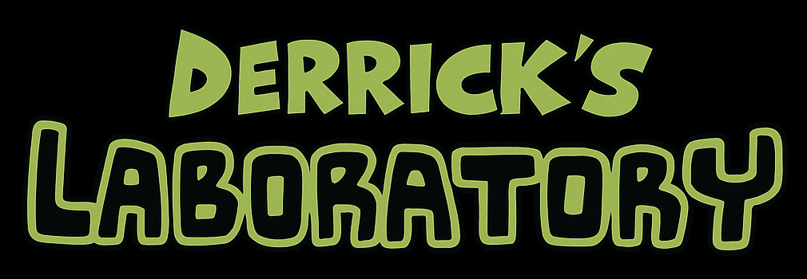

   

  

Hi, I'm Derrick 👋 welcome to my laboratory! 🧪

This is my place to share my experiments, projects, and more.

  

  

## 🥽 experiments & projects 🚀

> **[Win Win Solutions](https://chatgpt.com/g/g-67abe1ced6248191b9e4e2ab2418f31e-win-win-solutions)**
> 
> Expert negotiator and problem solver crafting win-win solutions to complex challenges.

> **[Compare and Contrast](https://chatgpt.com/g/g-67ab514a48188191ad9a40b5eeaf039f-compare-and-contrast)**
> 
> Provides expert comparisons across tech, tools, investments, concepts, vendors, and more.

> **[The Way to Wealth](https://chatgpt.com/g/g-67b565c48c8081919a17a2aac2af0b8f-the-way-to-wealth)**
> 
> Personal finance mentor blending Ben Franklin’s timeless wisdom with modern money strategies.

> **[Uptime Monitor for select Microsoft-owned Sites](https://derrick-roach.github.io/microsoft-uptime/)**
> 
> An open-source uptime monitor and status page, powered entirely by GitHub. This is a sample status page that regularly checks availability of several Microsoft-owned sites. No server required — just GitHub Actions, Issues, and Pages.

> **[U.S. Federal Government Website Uptime Monitor](https://derrick-roach.github.io/us-fed-gov-uptime/)**
> 
> An open-source uptime monitor and status page, powered entirely by GitHub. This is a sample status page which regularly checks availability of several US Federal Government websites. No server required — just GitHub Actions, Issues, and Pages.

> **[Free ZAP Baseline Scan](https://github.com/derrick-roach/free-zap-baseline-scan)**
> 
> A GitHub-powered (Actions & Issues) passive security testing tool using ZAP baseline scan to quickly identify misconfigurations and vulnerabilities in web applications.

  
&nbsp;
&nbsp;
&nbsp;
  

## 🔗 links

  

Made with 💚 by [Derrick](https://github.com/derrick-roach)
